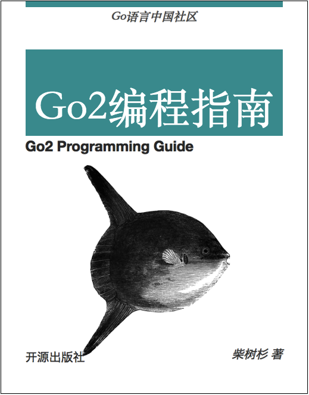

# Go2编程指南

*推广: [《WebAssembly标准入门》开始预售了，欢迎关注！](https://github.com/chai2010/awesome-wasm-zh/blob/master/webassembly-primer.md)([京东购买](https://item.jd.com/12499372.html))*

----

本书重点讲解Go2新特性，以及Go1教程中较少涉及的特性。本书适合对Go语言有一定基础的用户学习。

- 作者：柴树杉，Github [@chai2010](https://github.com/chai2010)，Twitter [@chaishushan](https://twitter.com/chaishushan)

## 在线阅读

- [SUMMARY.md](SUMMARY.md)
- https://chai2010.cn/go2-book/

## 相关报告

1. [GIAC: 2018 - Go 语言将要走向何方？(PDF)](https://chai2010.cn/static-public/talks/giac2018-go-talk.pdf) 上海·GIAC全球互联网架构大会 2018/11/23

## 版权声明

 Go2编程指南 由 <a xmlns:cc="http://creativecommons.org/ns#" href="https://github.com/chai2010/go2-book" property="cc:attributionName" rel="cc:attributionURL">柴树杉</a> 采用 <a rel="license" href="http://creativecommons.org/licenses/by-nc-nd/4.0/">知识共享 署名-非商业性使用-禁止演绎 4.0 国际 许可协议</a>进行许可。

严禁任何商业行为使用或引用该文档的全部或部分内容！

欢迎大家提供建议！

